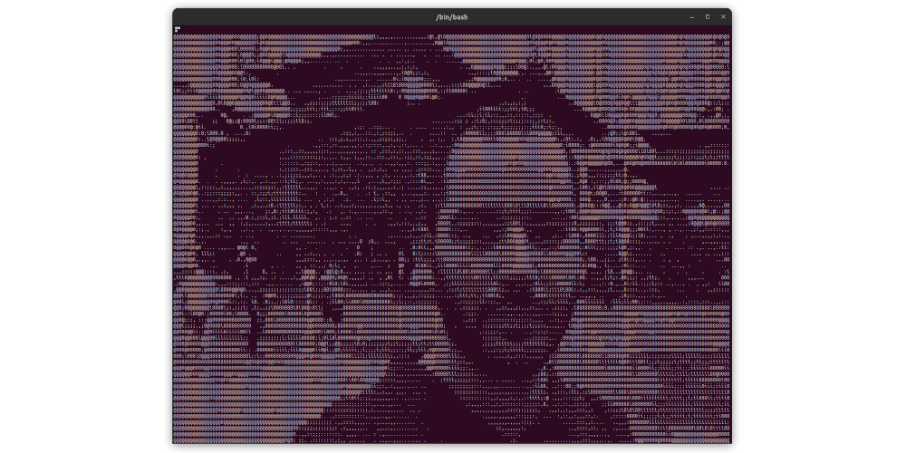

# Terimg

In-terminal ASCII webcam viewer



## How to run

Download binary from the releases. Run it:

```bash
./terimg
./terimg -h # for other options
```


## From source

```bash
cmake .
make
```

- then run the binary:

```bash
./terimg
```

